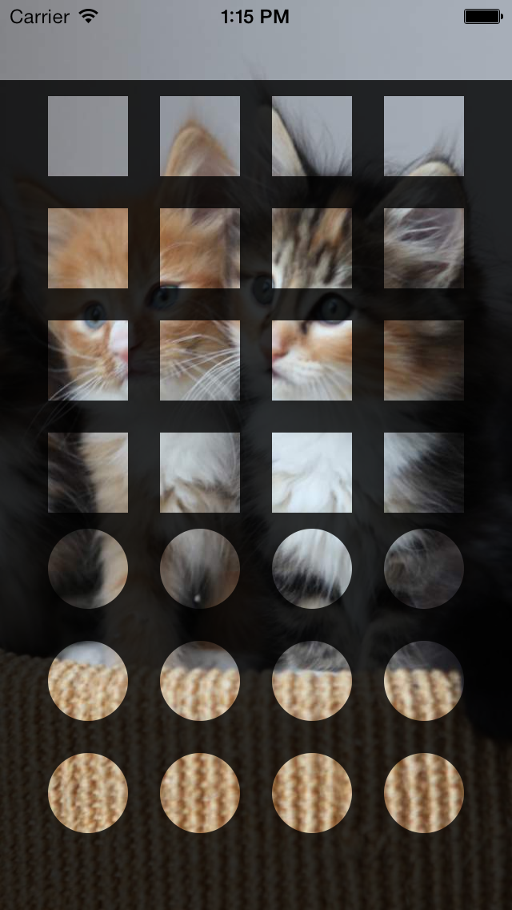

HoledView
=========

HoledView - Create a hole in your UIView

This project is a small example on how to create a "hole" in a `UIView`.

You can use it when need to show a small portion of the underlying  `UIView`

Thanks to {placekitten} for the background image. http://placekitten.com/

